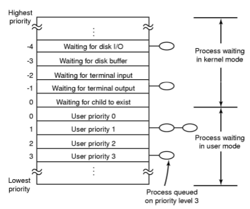
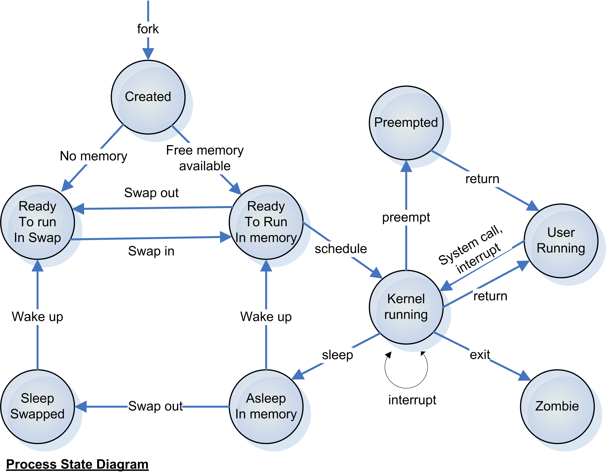

// build_options: 
Java Performance Tuning - Operating Systems Internals
=====================================================
Arnauld Van Muysewinkel <avm@pendragon.be>
v0.1, 15-Nov-2015: Draft version
:backend: slidy
//:theme: volnitsky
:data-uri:
:copyright: Creative-Commons-Zero (Arnauld Van Muysewinkel)

Content
-------

* References
* Schedulling
* others?

_(link:../0-extra/1-training_plan.html#_extras[back to course plan])_

References
----------

* ( http://elsoc.wikia.com/wiki/Scheduling#Interactive_Scheduling_Algorithms )

Schedulling
-----------

Schedulling
-----------

That's all folks!
-----------------

[cols="^",grid="none",frame="none"]
|=====
|image:../thats-all-folks.png[link="#(1)"]
|=====
