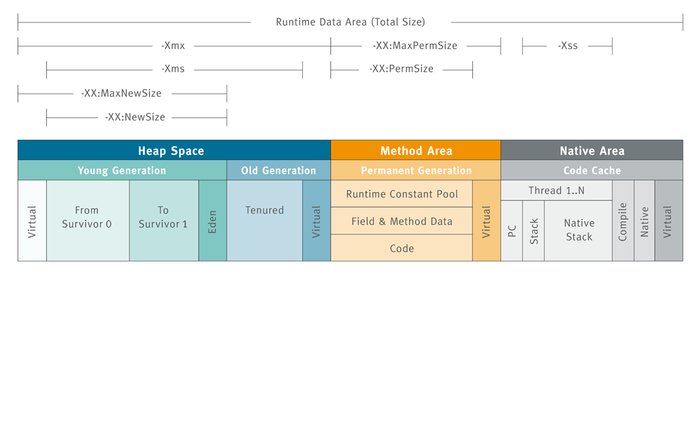
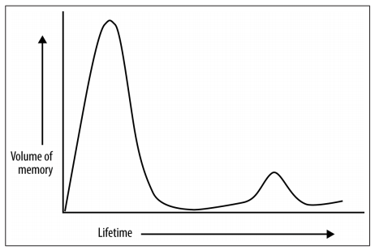
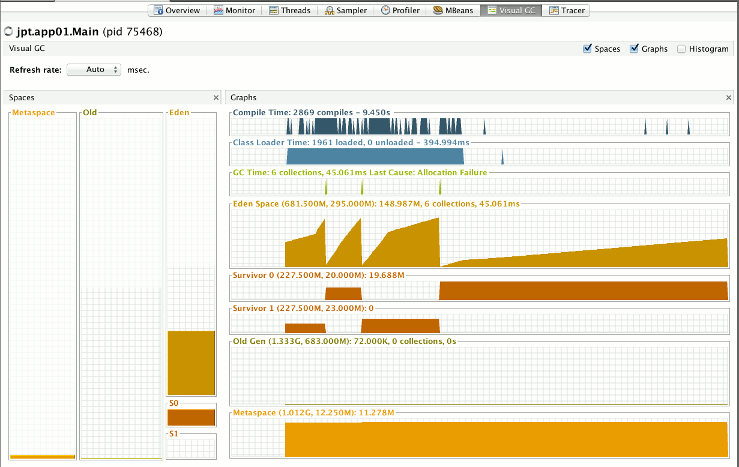

// build_options: 
Java Performance Tuning - Java VM Internals
===========================================
Arnauld Van Muysewinkel <avm@pendragon.be>
v1.0, 15-Nov-2015: First version
:backend: slidy
//:theme: volnitsky
:data-uri:
:copyright: Creative-Commons-Zero (Arnauld Van Muysewinkel)
:br: pass:[ ]

Content
-------

* <<_references,References>>
* <<_part_1,Garbage Collectors>>
* <<_part_2,Just-In-Time Compilers>>
//* others?

_(link:../0-extra/1-training_plan.html#_extras[back to course plan])_

References
----------

* Java Garbage Collection handbook. Plumbr. https://plumbr.eu/java-garbage-collection-handbook
* GC Algorithms: Implementations. Plumbr. https://plumbr.eu/handbook/garbage-collection-algorithms-implementations
** Complete course
* Visualizing Garbage Collection Algorithms. Ken Fox. http://spin.atomicobject.com/2014/09/03/visualizing-garbage-collection-algorithms/
** Animated GIFs
* Visualizing Java Garbage Collection https://www.infoq.com/presentations/Visualizing-Java-GC
** Video presentation
* Understanding Java Garbage Collection and What You Can Do about It https://www.infoq.com/presentations/Understanding-Java-Garbage-Collection
** Video advanced presentation

Part 1
------

[graphviz,generated-images/GC_title.png,twopi]
-----
digraph G {
  size = "7,4";
  title[shape=doubleoctagon, label="Garbage Collectors", fontsize=36, fontname="sansserif bold"]
}
-----

JVM Memory model
----------------

* native area: per thread: java stack, native stack
* method area: permanent generation
* heap space

What is Garbage Collection (GC)
-------------------------------

* Getting rid of unused objects and release memory?

Actually:

. Find all objects in use
. Mark all _the rest_ as garbage

(Too) simple solution: References Counting
------------------------------------------

Counting the references to an object may easily be automated.
(E.g. Python prior v2)

[graphviz,generated-images/ref_counting-1.png,fdp]
-----
digraph G {
  size = "7,4";

  GC_root_1 -> p11 -> p12 -> p13 -> p11
  GC_root_1 -> p14
  GC_root_1 -> p15 -> p16 -> p17 -> p18 -> p19 -> p17

  GC_root_2 -> p21 -> p22 -> p23 -> p21
               p23 -> p24 -> p23
  GC_root_2 -> p25
  
  GC_root_3 -> p31 -> p32 -> p31
  GC_root_3 -> p33 -> p34

  p41 -> p42

  p51

  p61 -> p62
  p61 -> p63

  p71

  GC_root_1[label="GC root",shape=Msquare,style="rounded,filled",fillcolor=lightgoldenrod]
  GC_root_2[label="GC root",shape=Msquare,style="rounded,filled",fillcolor=lightgoldenrod]
  GC_root_3[label="GC root",shape=Msquare,style="rounded,filled",fillcolor=lightgoldenrod]

  p11[label=" ",shape=circle]
  p12[label=" ",shape=circle]
  p13[label=" ",shape=circle]
  p14[label=" ",shape=circle]
  p15[label=" ",shape=circle]
  p16[label=" ",shape=circle]
  p17[label=" ",shape=circle]
  p18[label=" ",shape=circle]
  p19[label=" ",shape=circle]
  p21[label=" ",shape=circle]
  p22[label=" ",shape=circle]
  p23[label=" ",shape=circle]
  p24[label=" ",shape=circle]
  p25[label=" ",shape=circle]
  p31[label=" ",shape=circle]
  p32[label=" ",shape=circle]
  p33[label=" ",shape=circle]
  p34[label=" ",shape=circle]
  p41[label=" ",shape=circle]
  p42[label=" ",shape=circle]
  p51[label=" ",shape=circle]
  p61[label=" ",shape=circle]
  p62[label=" ",shape=circle]
  p63[label=" ",shape=circle]
  p71[label=" ",shape=circle]

}
-----

(Too) simple solution: References Counting
------------------------------------------

...

[graphviz,generated-images/ref_counting-2.png,fdp]
-----
digraph G {
  size = "7,4";

  GC_root_1 -> p11 -> p12 -> p13 -> p11
  GC_root_1 -> p14
  GC_root_1 -> p15 -> p16 -> p17 -> p18 -> p19 -> p17

  GC_root_2 -> p21 -> p22 -> p23 -> p21
               p23 -> p24 -> p23
  GC_root_2 -> p25
  
  GC_root_3 -> p31 -> p32 -> p31
  GC_root_3 -> p33 -> p34

  p41 -> p42

  p51

  p61 -> p62
  p61 -> p63

  p71

  GC_root_1[label="GC root",shape=Msquare,style="rounded,filled",fillcolor=lightgoldenrod]
  GC_root_2[label="GC root",shape=Msquare,style="rounded,filled",fillcolor=lightgoldenrod]
  GC_root_3[label="GC root",shape=Msquare,style="rounded,filled",fillcolor=lightgoldenrod]

  p11[label="2",shape=circle,color=limegreen,penwidth=2]
  p12[label="1",shape=circle,color=limegreen,penwidth=2]
  p13[label="1",shape=circle,color=limegreen,penwidth=2]
  p14[label="1",shape=circle,color=limegreen,penwidth=2]
  p15[label="1",shape=circle,color=limegreen,penwidth=2]
  p16[label="1",shape=circle,color=limegreen,penwidth=2]
  p17[label="2",shape=circle,color=limegreen,penwidth=2]
  p18[label="1",shape=circle,color=limegreen,penwidth=2]
  p19[label="1",shape=circle,color=limegreen,penwidth=2]
  p21[label="2",shape=circle,color=limegreen,penwidth=2]
  p22[label="1",shape=circle,color=limegreen,penwidth=2]
  p23[label="2",shape=circle,color=limegreen,penwidth=2]
  p24[label="1",shape=circle,color=limegreen,penwidth=2]
  p25[label="1",shape=circle,color=limegreen,penwidth=2]
  p31[label="2",shape=circle,color=limegreen,penwidth=2]
  p32[label="1",shape=circle,color=limegreen,penwidth=2]
  p33[label="1",shape=circle,color=limegreen,penwidth=2]
  p34[label="1",shape=circle,color=limegreen,penwidth=2]
  p41[label="0",shape=circle,style=filled,fillcolor="lightgrey"]
  p42[label="1",shape=circle,style=filled,fillcolor="lightgrey"]
  p51[label="0",shape=circle,style=filled,fillcolor="lightgrey"]
  p61[label="0",shape=circle,style=filled,fillcolor="lightgrey"]
  p62[label="1",shape=circle,style=filled,fillcolor="lightgrey"]
  p63[label="1",shape=circle,style=filled,fillcolor="lightgrey"]
  p71[label="0",shape=circle,style=filled,fillcolor="lightgrey"]

}
-----

(Too) simple solution: References Counting
------------------------------------------

But:

[graphviz,generated-images/ref_counting-3.png,fdp]
-----
digraph G {
  size = "7,4";

  GC_root_1 -> p11 -> p12 -> p13 -> p11
  GC_root_1 -> p14
  GC_root_1 -> p15 -> p16
               p16 -> p17 [style=invis]
               p17 -> p18 -> p19 -> p17

  GC_root_2 -> p21 -> p22 -> p23 -> p21
               p23 -> p24 -> p23
  GC_root_2 -> p25

  GC_root_3 -> p31 -> p32 -> p31
  GC_root_3 -> p33 -> p34

  p41 -> p42

  p51

  p61 -> p62
  p61 -> p63

  p71

  GC_root_1[label="GC root",shape=Msquare,style="rounded,filled",fillcolor=lightgoldenrod]
  GC_root_2[label="GC root",shape=Msquare,style="rounded,filled",fillcolor=lightgoldenrod]
  GC_root_3[label="GC root",shape=Msquare,style="rounded,filled",fillcolor=lightgoldenrod]

  p11[label="2",shape=circle,color=limegreen,penwidth=2]
  p12[label="1",shape=circle,color=limegreen,penwidth=2]
  p13[label="1",shape=circle,color=limegreen,penwidth=2]
  p14[label="1",shape=circle,color=limegreen,penwidth=2]
  p15[label="1",shape=circle,color=limegreen,penwidth=2]
  p16[label="1",shape=circle,color=limegreen,penwidth=2]
  p17[label="1",shape=circle,color=red,penwidth=2,style=filled,fillcolor="rosybrown"]
  p18[label="1",shape=circle,color=red,penwidth=2,style=filled,fillcolor="rosybrown"]
  p19[label="1",shape=circle,color=red,penwidth=2,style=filled,fillcolor="rosybrown"]
  p21[label="2",shape=circle,color=limegreen,penwidth=2]
  p22[label="1",shape=circle,color=limegreen,penwidth=2]
  p23[label="2",shape=circle,color=limegreen,penwidth=2]
  p24[label="1",shape=circle,color=limegreen,penwidth=2]
  p25[label="1",shape=circle,color=limegreen,penwidth=2]
  p31[label="2",shape=circle,color=limegreen,penwidth=2]
  p32[label="1",shape=circle,color=limegreen,penwidth=2]
  p33[label="1",shape=circle,color=limegreen,penwidth=2]
  p34[label="1",shape=circle,color=limegreen,penwidth=2]
  p41[label="0",shape=circle,style=filled,fillcolor="lightgrey"]
  p42[label="1",shape=circle,style=filled,fillcolor="lightgrey"]
  p51[label="0",shape=circle,style=filled,fillcolor="lightgrey"]
  p61[label="0",shape=circle,style=filled,fillcolor="lightgrey"]
  p62[label="1",shape=circle,style=filled,fillcolor="lightgrey"]
  p63[label="1",shape=circle,style=filled,fillcolor="lightgrey"]
  p71[label="0",shape=circle,style=filled,fillcolor="lightgrey"]

}
-----

GC Principles: GC threads
-------------------------

Conclusion: it is necessary to regularly "browse" the memory to find objects that can be released.

! Must be thread safe.

"stop the world"::
** all application threads are "marked" so they know they should stop
** each application thread stops when reaching a _safe point_
** Collection may start when all application threads are halted

GC Principles: GC roots
-----------------------

"Any object reference your program can access directly,
without going through another object",
i.e. all objects that _cannot_ be released.

Or: GC roots are _external_ pointers, i.e. those where the parent and child
are in different memory pools.

* Class loaded by _system_ class loaders (not by custom ones)
* Active threads
* Local variables
* Static fields
* JNI references
* ...

GC Principles: Mark and Sweep
-----------------------------

[horizontal]
Mark:: walk through all objects reachable from GC roots
Sweep:: return all other objects to the pool of available space
!:: "stop the world"

All GC algorithms are variations of this two steps processing.

GC Principles: Mark and Sweep
-----------------------------

[graphviz,generated-images/mark_and_sweep.png,fdp]
-----
digraph G {
  size = "7,4";

  GC_root_1 -> p11 -> p12 -> p13 -> p11
  GC_root_1 -> p14
  GC_root_1 -> p15 -> p16
               p16 -> p17 [style=invis]
               p17 -> p18 -> p19 -> p17

  GC_root_2 -> p21 -> p22 -> p23 -> p21
               p23 -> p24 -> p23
  GC_root_2 -> p25
  
  GC_root_3 -> p31 -> p32 -> p31
  GC_root_3 -> p33 -> p34

  p41 -> p42

  p51

  p61 -> p62
  p61 -> p63

  p71

  GC_root_1[label="GC root",shape=Msquare,style="rounded,filled",fillcolor=lightgoldenrod]
  GC_root_2[label="GC root",shape=Msquare,style="rounded,filled",fillcolor=lightgoldenrod]
  GC_root_3[label="GC root",shape=Msquare,style="rounded,filled",fillcolor=lightgoldenrod]

  p11[label="x",shape=circle,color=limegreen,penwidth=2]
  p12[label="x",shape=circle,color=limegreen,penwidth=2]
  p13[label="x",shape=circle,color=limegreen,penwidth=2]
  p14[label="x",shape=circle,color=limegreen,penwidth=2]
  p15[label="x",shape=circle,color=limegreen,penwidth=2]
  p16[label="x",shape=circle,color=limegreen,penwidth=2]
  p17[label=" ",shape=circle,style=filled,fillcolor="lightgrey"]
  p18[label=" ",shape=circle,style=filled,fillcolor="lightgrey"]
  p19[label=" ",shape=circle,style=filled,fillcolor="lightgrey"]
  p21[label="x",shape=circle,color=limegreen,penwidth=2]
  p22[label="x",shape=circle,color=limegreen,penwidth=2]
  p23[label="x",shape=circle,color=limegreen,penwidth=2]
  p24[label="x",shape=circle,color=limegreen,penwidth=2]
  p25[label="x",shape=circle,color=limegreen,penwidth=2]
  p31[label="x",shape=circle,color=limegreen,penwidth=2]
  p32[label="x",shape=circle,color=limegreen,penwidth=2]
  p33[label="x",shape=circle,color=limegreen,penwidth=2]
  p34[label="x",shape=circle,color=limegreen,penwidth=2]
  p41[label=" ",shape=circle,style=filled,fillcolor="lightgrey"]
  p42[label=" ",shape=circle,style=filled,fillcolor="lightgrey"]
  p51[label=" ",shape=circle,style=filled,fillcolor="lightgrey"]
  p61[label=" ",shape=circle,style=filled,fillcolor="lightgrey"]
  p62[label=" ",shape=circle,style=filled,fillcolor="lightgrey"]
  p63[label=" ",shape=circle,style=filled,fillcolor="lightgrey"]
  p71[label=" ",shape=circle,style=filled,fillcolor="lightgrey"]

}
-----

GC Principles: Compacting
-------------------------

* Avoid fragmentation, which:
** slows down allocation
** limits available memory

-> achieved by moving all objects in contiguous blocks

* can be quite slow
* needs to "stop the world"

GC Principles: "Generational Hypothesis"
----------------------------------------

Under this hypothesis, the JVM memory may be divided in two regions,
managed independently:

* "Young generation"
* "Old generation" / "Tenured"

! An object referencing an object in another region is
a GC root for that region, since it cannot be released.

GC Principles: Memory Pools
---------------------------

Memory is typically divided as follows
(there might be some variations, depending on the algorithm):

[graphviz,generated-images/memory_pools.png]
-----
digraph G {
  size = "7,4";
  node [shape=plaintext];
  struct [label=<
<TABLE BORDER="0"><TR><TD>
<TABLE CELLSPACING="0" CELLPADDING="5">
<TR><TD BGCOLOR="palegreen" HEIGHT="50">Eden</TD><TD BGCOLOR="palegreen">S1*</TD><TD BGCOLOR="palegreen">S2*</TD>
  <TD ROWSPAN="2" BGCOLOR="lightgoldenrod">Tenured</TD><TD ROWSPAN="2" BGCOLOR="indianred">PermGen</TD></TR>
<TR><TD COLSPAN="3" BGCOLOR="palegreen3">Young</TD></TR>
</TABLE>
</TD></TR><TR><TD ALIGN="left">* "Survivor" spaces</TD></TR></TABLE>
>]
}
-----

GC Principles: Memory Pools
---------------------------

Eden::
* where the objects are allocated when created
* subdivisions by threads to avoid synchronisation
* triggers a young collection when full
* objects surviving young collection are copied to one of the survivor spaces
* then the whole area is considered empty (no need to explicitely delete all unmarked objects)
* = +Mark and Copy+ (thanks to the copy, no need to +sweep+ and the +compact+ is done on the fly)

GC Principles: Memory Pools
---------------------------

Survivor spaces::
* one of S1/S2 is always 'empty'
* during each young generation:
** all surviving objects are copied from Eden to 'empty' S__i__
** all surviving from 'not-empty' are copied from Eden to 'empty' S__i__
* then their role is switched
* S__i__ must remain small enough since it's half _wasted_ space
* once an object has been copied _n_ times,
  it's considered old enough to be copied to tenured space (cf. "Generational Hypothesis")
  -> +tenuring threshold+

GC Principles: Memory Pools
---------------------------

[graphviz,generated-images/survivor_spaces-1.png]
-----
digraph G {
  size = "4,4";
  rankdir=LR;
  node [shape=rect];

  Eden -> Si_empty [style=invis]
  Si_notempty -> Si_empty [style=invis]
  Eden -> Si_notempty [style=invis]

  Eden[shape=square, style=filled, fillcolor=lightgrey]
  subgraph {
    rank=same;
    
    Si_empty[label="S2 (empty)"]
    Si_notempty[label="S1 (not empty)", style=filled, fillcolor=lightgrey]
  }

  Si_empty -> Tenured [style=invis]
  Si_notempty -> Tenured [style=invis]
  Tenured[shape=square, style=filled, fillcolor=lightgrey]
}
-----

GC Principles: Memory Pools
---------------------------

[graphviz,generated-images/survivor_spaces-2.png]
-----
digraph G {
  size = "4,4";
  rankdir=LR;
  node [shape=rect];

  Eden -> Si_empty
  Si_notempty -> Si_empty [label="n=n+1"]
  Eden -> Si_notempty [style=invis]

  Eden[shape=square, style=filled, fillcolor=lightgrey]
  subgraph {
    rank=same;
    
    Si_empty[label="S2 (empty)"]
    Si_notempty[label="S1 (not empty)", style=filled, fillcolor=lightgrey]
  }

  Si_empty -> Tenured [style=invis]
  Si_notempty -> Tenured [label="n>15?"]
  Tenured[shape=square, style=filled, fillcolor=lightgrey]
}
-----

GC Principles: Memory Pools
---------------------------

[graphviz,generated-images/survivor_spaces-3.png]
-----
digraph G {
  size = "4,4";
  rankdir=LR;
  node [shape=rect];

  Eden -> Si_notempty [style=invis]
  Si_empty -> Si_notempty [style=invis]
  Eden -> Si_empty [style=invis]

  Eden[shape=square, style=filled, fillcolor=lightgrey]
  subgraph {
    rank=same;
    
    Si_notempty[label="S2 (not empty)", style=filled, fillcolor=lightgrey]
    Si_empty[label="S1 (empty)"]
  }

  Si_empty -> Tenured [style=invis]
  Si_notempty -> Tenured [style=invis]
  Tenured[shape=square, style=filled, fillcolor=lightgrey]
}
-----

GC Principles: Memory Pools
---------------------------

Eden + Survivor spaces::

GC Principles: Memory Pools
---------------------------

Old Generation / Tenured::
* much bigger
* less frequent collections
* [line-through]+Mark and Copy+, objects are moved around to minimize fragmentation:
** +Mark+
** +Delete+
** +Compact+
* much slower

GC Principles: M&C vs. MSC
--------------------------

Mark-and-Copy::
image:images/GC-mark-and-copy-in-Java.png[]

Mark-Sweep-Compact::
image:images/GC-mark-sweep-compact.png[]

GC Principles: Collection kinds
-------------------------------

Minor GC:: young space
Major GC:: old space
Full GC:: both

GC Principles: Triggers
-----------------------

These events trigger a memory collection cycle:

* periodic collection
* memory usage above threshold
* allocation failure
* +System.gc()+, i.e. +Runtime.gc()+

GC Strategies
-------------

JRockit 6::
* ...

HotSpot 6, 7::
* "Parallel": minor collections with multiple threads in //
* "ParallelOld": parallel compaction during major collections
* "Serial"; for monocore CPU
* "ConcMarkSweep":
** most of the collection work is done concurrently with application threads
** but there is no compaction

HotSpot 8, 9::
* "G1": improved algorithm, based on the Mark-and-Copy principles
* default as of version 9

GC Strategies
-------------

[options="header", cols="1<,3^,3^"]
|===
| Strategy      | Young                  | Tenured

| Serial        | Mark-and-Copy    (stw) | Mark-Sweep-Compact (stw)
| Parallel      | // Mark-and-Copy (stw) | -
| ParallelOld   | -                      | // Mark-Sweep-Compact (stw)
| ConcMarkSweep | // Mark-and-Copy (stw) | // Mark-Sweep (mostly concurrent)
|====

(stw = "stop-the-world")

GC Strategies: Choice
---------------------

* Parallel/ParallelOld: better for throughput, typically for +batches+
* ConcMarkSweep :
** better for optimal response time (less "stop the world"), typically for +web applications+
** also better when there are strong limitations on available memory (mobile devices, cloud instances...)

GC and Memory paging
--------------------

* GC is constantly accessing the whole heap area.
* this breaks the "locality of reference" principle
* it breaks the paging algorithms

=> Avoid!

OutOfMemoryError
----------------

Is thrown when:

* after: heap full -> full GC -> -XX:GCTimeLimit exceeded (98%)
* after: heap full -> full GC -> -XX:GCHeapFreeLimit exceeded (2%)
* native memory is full
* stack or perm gen filled

Part 2
------

[graphviz,generated-images/JIT_title.png,twopi]
-----
digraph G {
  size = "7,4";
  title[shape=doubleoctagon, label="Just-in-Time\nCompilation", fontsize=36, fontname="sansserif bold"]
}
-----

JIT: Origin
-----------

* General purpose language
* Bytecode

=> originally slow

=> need machine specific optimization

-> solution: JIT (HotSpot)

WARNING: JIT started only after 10,000 iterations (server mode)!{br}
(client mode: 1500 iterations)

That's all folks!
-----------------

[cols="^",grid="none",frame="none"]
|=====
|image:../thats-all-folks.png[link="#(1)"]
|=====
