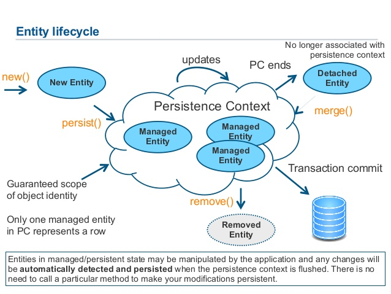

// build_options: 
Java Performance Tuning - Best Practices
========================================
Arnauld Van Muysewinkel <avm@pendragon.be>
v0.1, 17-Nov-2015: First version
:backend: slidy
//:theme: volnitsky
:data-uri:
:icons:
:copyright: Creative-Commons-Zero (Arnauld Van Muysewinkel)
:br: pass:[ ]

Content
-------

* <<_references,References>>
* <<_introduction,Introduction>>
* <<_general_recommendations,General Recommendations>>
* <<_jsf_ui_debug,JSF>>
* <<_ejb,EJB>>
* <<_sessions,Sessions>>
* <<_transactions,Transactions>>
* <<_jpa,JPA>>
* <<_sql,SQL>>
* <<_concurrency,Concurrency>>
* <<_caching,Caching>>
* <<_conclusion,Conclusion>>

_(link:../0-extra/1-training_plan.html#_extras[back to plan])_

References
----------

This presentation is derived from:

* http://centers.intranext.smals.be/SIC/Wiki/Pages/WIKI_Best_Practices_for_Performance.aspx[SIC Wiki / Best Practices for Performance]
* Résumé de la Formation Oracle Performance Tuning. Romain Genon. Smals / SIC. 2015
* JPA Concepts. Yannick Majoros. Smals / SIC. 14-Nov-2014

Other useful source of information:

* Top 10 Causes of Java EE Enterprise Performance Problems (https://dzone.com/articles/top-10-causes-java-ee)

Introduction
------------

These recommendations apply to JEE development.

*****
IMPORTANT: Do-not-reinvent-the-wheel
*****

General recommendations
-----------------------

NOTE: Never, ever, use non-final static variables

(Note: constants, loggers must be final static variables)

NOTE: Don't rely on default locale:

no Locale.setDefault(), no Locale.getDefault(), no new formatter without passing a Locale; see jdss wiki

JSF: ui:debug
-------------

NOTE: Remove +<ui:debug hotkey="i"/>+

* Tip: use +rendered="#{initParam['javax.faces.PROJECT_STAGE'] eq 'Development'}"+
* _Example: in Publiato session size 3Mb -> 500kB_

JSF: Viewstate
--------------

NOTE: reduce length of navigation history to reduce size of view state

JSF: Viewstate
--------------

NOTE: ViewState server-side vs. client-side

.In "web.xml"
-----
<context-param>
<param-name>javax.faces.STATE_SAVING_METHOD</param-name>
<param-value>server/client</param-value>
</context-param>
-----

* The short story:
** *server*: if few users, avoids too big HTML pages
** *client*: reduces session size in server memory

*Caution*: client-side is the default setup in a Smals project!

JSF: Viewstate
--------------

* Longer story:{br}
If you decide using a JSF Viewstate client-side, balance this decision with all the drawbacks of it: bandwidth, security, additional layers to avoid leaks, etc.
* More specifically, read this:
 
*****
[quote,"JSF ViewState upside-down" (http://www.synacktiv.fr/ressources/JSF_ViewState_InYourFace.pdf)]
_____
It is highly recommended to think twice before using a client side ViewState. If for some reasons you need it, here is a checklist you may want to follow:

* Always validate the scope of Java objects. It is not recommended to use the scope @ViewScoped, because it is often the source of information leaks.
* Use the keyword transient on attributes you do not want to store in the ViewState. It will prevent their serialization.
* Always encrypt the ViewState and use an integrity check mechanism if the implementation supports it.
* Never trust the data contained in a ViewState. Consider they have been potentially tampered by a user. So, you must check them carefully to prevent the attacks previously described.

For security reasons, server side storage is highly recommended.
http://www.synacktiv.fr/ressources/JSF_ViewState_InYourFace.pdf[>>>]
_____
*****

JSF: DTO
--------

NOTE: Use DTO's in the component tree, not JPA entities!

pass:[...] to make sure only really needed data is kept (beware of all "rubbish" loaded by JPA!)

JSF: Identifiers
----------------

NOTE: Don't let JSF autogenerate elements identifiers (+j_idtXXX+),

to facilitate the maintenance of tests scripts (whether jmeter or Selenium)

EJB
---

NOTE: Don't use Remote EJB if not needed (performance impact!)

* Remote EJB entails serialization/deserialization
* Prefer local EJB

Sessions
--------

NOTE: Sessions must be serializable:

* all objects under the session must be serializable (whole objects graph!)
* avoid big objects in the session
* Use DTO's

Actually, the potential issues are the same as for JSF ViewContext.

Transactions
------------

NOTE: Choose carefully the transaction type

Transaction attribute type can have one of the following values:

* +Required+
* +RequiresNew+
* +Mandatory+
* +NotSupported+
* +Supports+
* +Never+

See http://docs.oracle.com/javaee/6/api/javax/ejb/TransactionAttributeType.html[Javadoc]

JPA
---

NOTE: Make sure you manually disabled all (shared) caching (L2 cache)

in persistence.xml (! default for eclipselink is to enable the shared cache)

NOTE: Carefully tune LAZY vs. EAGER

FYI: defaults:

* for {One,Many}ToOne is *EAGER*,
* for {One,Many}ToMany is *LAZY*

_Example: in Publiato session size 500kB -> 250 kB because of PDF attachment uselessly retrieved by JPA_

JPA
---

NOTE: Fetch when necessary, if necessary

NOTE: Use (native) queries when retrieving only tiny pieces of data

pass:[...] to avoid loading whole object tree when only

_Example: in ePV response time 20s -> 1s because a big object tree was loaded in LAZY mode, just to retrieve one integer_

NOTE: Make sure your data model does not imply O(n) or O(n2) performance

JPA
---

http://www.slideshare.net/ecosio/introduction-to-jpa-and-hibernate-using

JPA
---

NOTE: merge != persist != save

NOTE: avoid: flush, refresh

NOTE: bidirectional relationships must be maintained manually

NOTE: use fetch joins to avoid additional queries

NOTE: carefully choose the correct join type

SQL
---

NOTE: Use bind variables

* (do *not* inject parameters directly in your SQL query)
* avoids "hard parsing": execution plan is retrieved from "shared pool"

NOTE: Generally speaking, avoid creating your requests dynamicaly

("query-builder-like" applications are evil)

SQL
---

image::images/cncpt250.gif[]

Concurrency
-----------

NOTE: Do not use _any_ concurrency control mechanism

like:

* synchronized keyword
* ConcurrentHashMap
* ThreadLocal
* etc.

Concurrency
-----------

*****
.Why is thread creation and management disallowed?*
[quote, "EJB Restrictions" (http://www.oracle.com/technetwork/java/restrictions-142267.html)]
_____
The EJB specification assigns to the EJB container the responsibility
for managing threads. Allowing enterprise bean instances to create and manage threads
would interfere with the container's ability to control its components' lifecycle.
Thread management is not a business function, it is an implementation detail,
and is typically complicated and platform-specific.
Letting the container manage threads relieves the enterprise bean developer
of dealing with threading issues. Multithreaded applications are still possible,
but control of multithreading is located in the container, not in the enterprise bean.
http://www.oracle.com/technetwork/java/restrictions-142267.html[>>>]
_____
*****

Caching
-------

NOTE: Avoid using any custom-made cache.

* There are potential issues with caches (stuck threads, memory leaks)
* Use only recommended out-of-the-shelf solution (RB has approved usage of Inifinispan for local caches)
* Discuss it with review board
* Do not use a HashMap to share information between several threads:
** you cannot make it synchronized (see above, <<_concurrency,Concurrency>>)
** and, when it's not synchronized, there is a risk of infinite loop with Java version < 8 (http://bugs.java.com/view_bug.do?bug_id=7027300) (see also, for example, https://dzone.com/articles/java-7-hashmap-vs)

Conclusion
----------

IMPORTANT: Remember to check regularly SIC Wiki / Best Practices for Performance:

http://centers.intranext.smals.be/SIC/Wiki/Pages/WIKI_Best_Practices_for_Performance.aspx[
http://centers.intranext.smals.be/SIC/Wiki/Pages/]
http://centers.intranext.smals.be/SIC/Wiki/Pages/WIKI_Best_Practices_for_Performance.aspx[
WIKI_Best_Practices_for_Performance.aspx]

 http://c.xkcd.com/random/comic/[.]
