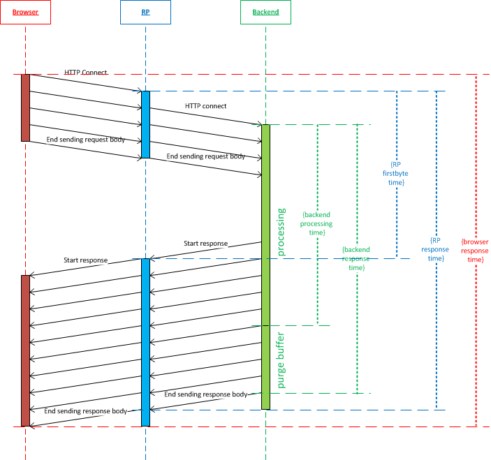
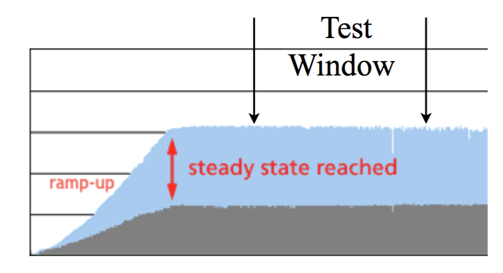

// build_options: 
Java Performance Tuning - Designing your benchmarks
===================================================
Arnauld Van Muysewinkel <avm@pendragon.be>
v0.1, 12-Oct-2015: Initial version
:backend: slidy
//:theme: volnitsky
:data-uri:
:copyright: Creative-Commons-Zero (Arnauld Van Muysewinkel)
:icons:
:br: pass:[ ]

_(link:../0-extra/1-training_plan.html#(5)[back to plan])_

Content
-------

* Introduction
// what is a performance test, objective (p4,5)
* Planning your tests
// Unit of Test (p6)
** Load profiles
// Types of performance tests (p12-13)
** Metrics
// Performance metrics (p8-9)
** Documentation
// work organization (documents) (p17)
** Process
// steps (p16)
* Anatomy of a test
** Actors
// actors (p20)
** Load profiles
// usage patterns - time (p22-26)
** Scenarios
** Cases
// usage patterns - data (caching!) (p27-28)
** Injector

// Test the test (p7)
// Possible results (p15)
// test env (vs. UoT) (p21)
// test execution (p29-31)
// analyse/verify results (p32-35)

&rtri; Introduction
-------------------

====
* References
* What is a performance test?
====

-> References
-------------

Performance tuning::
* *Java Performance Tuning (training/workshop). Kirk Perdine. Kodewerk*
   http://www.kodewerk.com/workshop.html

-> What is a performance test?
------------------------------

Test pursuing one or several of the following goals:

* assess
** responsiveness
** throughput
** concurrency
** scalability
** stability
* => measure the metrics and compare with expected values
* => in case of poor performance: identify the origin

&rtri; Planning your test
-------------------------

====
* What are we testing?
//* Why are we testing?
* Types of load profiles
* Performance metrics
* Documentation
* Process
====

-> What are we testing?
----------------------

[WARNING]
====
Define carefully the limits of the system being studied.

*"Unit of Test" &ne; "Test Harness"*
====

"Unit of Test" (UoT) = System being studied

{br}

"Test Harness" = the supporting infrastructure

* = system infrastructure + testing infrastructure
* system infrastructure must be iso-PROD!{br}
  (sizing, configuration... _all pieces of hardware_!)

-> -> Examples ...

Simple example of Test Harness
------------------------------

Let UoT = a single webapp, materialized by a WAR deployable,{br}
in a traditional infrastructure (i.e. virtualized, not containerized)

System infrastructure:

* RP cluster (2 nodes)
** 2 Linux virtual servers
* Weblogic cluster (2 sync nodes, 2 JVM's)
** 2 Linux virtual servers
* Weblogic admin
** 1 Linux virtual server (1 JVM)
* Database cluster (RAC)
** 3 Linux virtual servers

Simple example of Test Harness (cont'd)
---------------------------------------

But also:

* Hypervisors (ESX, or OVM, or ...)
** Physical servers
* VLAN
** Routers
** Firewalls
* Storage units
* Monitoring?

Simple example of Test Harness (cont'd)
---------------------------------------

Testing infrastructure:

* Injector
** Physical server
** VLAN
** Firewall?

! Must be distinct from the system infrastructure!{br}
Make sure your measure does not modify the performance of the system being tested.

More complex example of Test Harness
------------------------------------

Let UoT = a more complex (and more realistic!) JEE system:

* sync deployable (EAR)
* async deployable (EAR)
* invoking several SOAP WS
* sending/receiving messages through a messaging system (JMS, MQ...)
* ...

-> Where do we put the limits of the system?{br}
-> Are we able to duplicate the world?{br}
-> How do we make our test measures independent of the dependencies behaviour?

-> Types of Load profiles
-------------------------

load test::
** expected workload: the load is _under control_, in term of: # concurrent users +and+ throughput
** focus: system meeting requirements
stress test::
** high workloads, saturation
** focus: throughput and stability
** ! impact on the rest of the infrastructure (network, firewall, RP...)
** ! abnormal conditions, do not try to (over-)tune the response time
** -> look for failures

Types of Load profiles (cont'd)
-------------------------------

spike test::
** idem stress test with more saturation and shorter duration
** short term 
endurance test::
** long period of time
** focus: stability of the response time
reference test::
* one user
* no delay between steps
* many loops

-> Performance metrics
----------------------

Measures of the UoT (&ne; measures/monitoring of the Test Harness)

Instant measures: f(t)

[horizontal]
Response time:: (time _last_ byte of response is received) - (time first byte of request was sent){br}
Latency:: a.k.a. "firstbyte time": (time _first_ byte of response is received) - (time first byte of request was sent){
Concurrency:: count of concurrent requests at a given time{br}
  _(difficult to compute precisely: sort all timestamps (request *and* response), then travel the list while incrementing (request) / decrementing (response) a counter_

Timestamps
----------

[WARNING]
====
The timestamp given in the logs may be either the begin time (start processing request)
or the end time (completed processing response), depending on the system!

[horizontal]
jmeter:: 
_end time_ by default in the code, but {br}
*begin time* in the default configuration!

* configurable before starting jmeter, through +sampleresult.timestamp.start+ jmeter property
* verify with +props.get("sampleresult.timestamp.start")+ (cannot be changed at runtime)
httpd:: *begin time* by default (+%t+), {br}
configurable by using +%begin:t+ or +%end:t+ in the access log format definition
Tomcat:: *begin time*
WebLogic:: *end time*
====

Ambiguities with response times
-------------------------------

Performance metrics (cont'd)
----------------------------

Interval measures: f(t, &Delta;t)

[horizontal]
Throughput:: &Delta;n/&Delta;t; where n = number of transactions
Cumulated time:: &Sigma; response-time / &Delta;t
Workload:: &Delta;work/&Delta;t; where work is a measure of the work accomplished (e.g. # records, file size...)

Others

[horizontal]
Capacity:: how much workload the system can absorb
Availability:: amount of time system is available / &Delta;t
Scalability:: ability of the system to utilize more (or less) hardware to match variations of the workload (!up &ne; down)

Performance metrics statistics
------------------------------

*Instant measures*

** Average
** Min, Max
** Percentile: Pct~n~ = X | n% of the data is <=X{br}
(Note that median &equiv; Pct50)

Statistics can produce:

* a scalar, when calculated for the whole duration of the test
* f(t), when calculated for each fixed interval &Delta;t

*Interval measures*

** only one value per interval &Delta;t -> derived 'instant' mesure, with lower resolution
** it's possible to calculate statistics on this derived measure

Measure window
--------------

A scalar measure (e.g. average response time) should be taken only
over a time window where the system is in a steady state
(i.e. metrics remain stable), typically _after_ the rampup.

-> Documentation
----------------

* Architecture document of the UoT
* Test plan:
** goals
** scope (boundaries of the UoT)
** resources required (! including key people for running the test or for solving issues)
** schedulling
* Requirements: performance goals
* Test data: input data for the test scenario (! quantity and randomization)
* Test protocol: process, scenarios, load profiles...
* Test report:
** all results (measures and calculations)
** conclusions

-> Process
----------

* quality of inputs is key:
** precise requirements
** quantity and randomization of input data
** objective and well defined scope
* iterative process
** design
** test
** analyse
** fix

(More information in link:../4-process/0-perf_test_process.html[Performance Testing Process] presentation.)

Test results
------------

The outcome of one test loop might be any of the following:

* application breaks
* unexpected results
* insufficient performance
* results are OK (_sometimes..._ &#x1f609;)

Cause of incorect results may have various origins:

* application design / bugs
* infrastructure configuration
* ! testing infrastructure / test suite{br}
=> *Test your test!*

[quote, Chinese wise old man]
_____
Never under-estimate your own ability to make mistakes.
_____

&rtri; Anatomy of a test
------------------------

====
* Actors
* Load profiles
* Scenarios
* Cases
* Injector
// injector (p36)

// usage patterns - time (p22-26)
// usage patterns - data (caching!) (p27-28)

====

-> Actors
---------

Actors are the consumers of the services provided by the application being tested,
be it users (human actors) or other systems.

In the context of performance tests, actors:

* are simulated by one or several _injectors_,
* applying a given usage pattern, or _scenario_, to the UoT,
* fed by a collection of input data or _cases_,
* with different _load profiles_.

Actors
------

The _test suite_ is composed of all scenarios, cases data, load profile definitions

[graphviz]
-----
digraph G {
  size = "7,4";

  subgraph {
    rank=same;
    rankdir=LR;
    Injector -> UoT [minlen=4]
    UoT [shape=box]
  }

  scenario -> Injector [weight=2]
  cases -> Injector
  Injector -> "load profile" [dir=back]
  scenario[shape=none]
  cases[shape=none]
  "load profile"[shape=none]
}
-----

-> Load profiles characteristics
--------------------------------

* type: reference, load, stress, spike, endurance
* # of concurrent users _f(t)_
* # of concurrent sessions _f(t)_
* throughput setpoint _f(t)_
* duration:
** as an amount of time; or
** as a transactions count

Load profiles shapes
--------------------

* flat
* rampup - flat
* rampup - flat - rampdown
* stairs
* rampup only
* ...

Load profile requirements
-------------------------

* Existing system
** based on usage statistics (web site)
* To-be system
** assumptions on user behaviour ("think-time" between each screen, expected numbr of users...)
** external constraints (e.g. nightly jobs that must run between end of backups and beginning of business hours)

-> Scenarios
------------

A scenario is a description of a usage pattern.
There are possibly several scenarios for a given system.

* a scenario is a list of consecutive steps
* one step may correspond to several HTTP requests:
** static resources (images, css, js...){br}
_Do we want to simulate these? Often we assume they are cached by the browser, hence we ignore them. But it might not be the case!_
** AJAX calls
* there might be several _paths_ of actions possible in one scenario

Multiple paths in a scenario
----------------------------

Example:

* home -> list of cases -> process the case -> logout
* home -> list of cases -> logout
* home -> status page -> logout

_Moreover, it is frequent that the logout page is never hit, or that a user exits the application in the middle of a workflow!_

* It is very hard to predict all possible paths, even with usage logs.
* We don't want to write a separate scenario for every possible path.

Multiple paths in a scenario
----------------------------

To solve this we can use a statistical approach:

[graphviz]
-----
digraph G {
  size = "7,4";
  node [shape=none];

  { rank=same; rankdir=LR; home; list; process; logout }
  home -> list [label="90%"]
    list -> logout [label="25%"]
    list -> process [label="75%"]
      process -> logout
  home -> status [label="10%"]
    status -> logout
}
-----

_Weights may be infered from relative load requirements._

-> Cases
--------

One traversal of the scenario path requires a set of parameter values to feed the HTTP requests (e.g. the identifier of the case to process in the previous example).

[WARNING]
=====
* variety must be equivalent to the actual usage in production
* Re-using same parameter values often results in too many cache hits{br}
=> faster than normal system, too optimistic results!
=====

A good performance test requires lots of carefully randomized input data.
