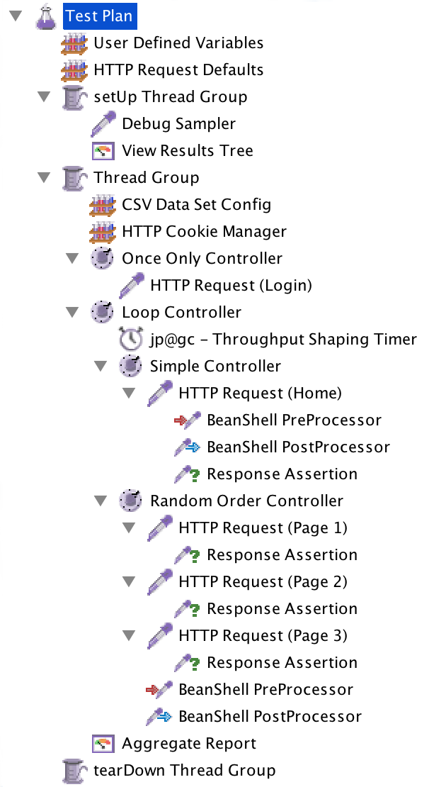

// build_options: 
Java Performance Tuning - Benchmarking tools
============================================
Arnauld Van Muysewinkel <avm@pendragon.be>
v1.0, 15-Nov-2015: First version
:backend: slidy
//:theme: volnitsky
:data-uri:
:copyright: Creative-Commons-Zero (Arnauld Van Muysewinkel)
:icons:
:br: pass:[ ]
:nil: pass:[</>]

Content
-------

* <<_rtri_requirements,Requirements>>
// GUI (heavy client) testing (p38-41)
// Regression testing (p42)
* <<_rtri_market_overview,Market overview>>
* <<_rtri_threading_model,Threading model>>, <<_rtri_back_pressure,Back-pressure>>
// injectors (p37)
// Standard APi testing (p43-44) + Gattling, LoadRunner ...
* <<_rtri_jmeter,JMeter>>
// Jmeter ... (pp45...83, 89...97)
** <<_jmeter_structure,Structure>>
** <<_jmeter_lifecycle,Lifecycle>>
** <<_jmeter_components,Components>>
// Threading model (p84-89)
* <<_randomization,Randomization>>
// ! _random_ parameters
// ! randomize _before_ run
// randomize timers
//** duration
// statistical representativeness
//** caching!
// p27-28
//** https://regex101.com
* <<_advanced_data_analysis,Advanced Data Analysis>>
* <<_mock_ups,Mock-Ups>>
// (p98-99)

_(link:../0-extra/1-training_plan.html#_presentations[back to course plan])_

&rtri; Requirements
-------------------

An injector is a tool that is able to _reproducibly_ generate a _well-defined_ load.

* Submit (receive) any kind of HTTP request (response)
* Submit other kind of requests (JDBC, RMI, (SOAP), execute Java code for specific cases)
* Represent complex scenario logic 
* Management of high number of virtual users
* _'Parameterizable'_
* Recording of results

Optional:

* real time display
* analysis, reporting

Kinds of testing tools
----------------------

[style="asciidoc",cols="^10,^1,^10,^1,^10",grid="none",frame="none"]
|=====
|GUI testing
|>
|*Protocol level testing*
|>
|Unit testing
|=====

* GUI testing
** fragile
** e.g. FAT client testing
* *Protocol (or API) level testing*
** HTTP, FTP, SOAP, SMTP, JDBC...
** robust, good isolation level -> best for performance testing
** e.g. web based
* Unit testing = Non-regression testing
** closer to micro-benchmarking
** e.g. JUnit

&rtri; Market Overview
----------------------

OpenSource software:

* *JMeter*: extended GUI, many protocols, scenario = XML tree
* Gatling: scenario = DSL (Scala code)
* Grinder: distributed testing with many injectors
* ...

Commercial software:

* HP LoadRunner (very complex)
* IBM Rational Performance Tester
* Borland Silk Performer
* ...

Commercial online services (cloud based):

* BlazeMeter
* Blitz
* ...

&rtri; Threading model
----------------------

JMeter::
* 1 virtual user = 1 thread, sync i/o
** subject to back-pressure effect
** each thread is blocked waiting for a response
** not suitable for heavy concurrency

Gatling::
* 1 virtual user != 1 thread, async i/o
** immune to back-pressure effect
** threads independant from pending responses
** suitable for heavy concurrency

&rtri; Back-pressure
--------------------

"\^Z test"::
* suspend server
* injector should continue sending requests to keep the injection rate steady +
(in the real world, users do not stop trying to connect to your web server when it is in trouble)
* But, if using a limited # of threads, and sync i/o, all the treads will soon be blocked, and the actual injection rate will drop to 0
* Using async i/o avoids this issue

&rtri; JMeter
-------------

*  Apache project: https://jmeter.apache.project
* 100% Java
* Many protocols:
** Web - HTTP, HTTPS
** SOAP / REST
** FTP
** Database via JDBC, MongoDB (NoSQL)
** LDAP
** Message-oriented middleware (MOM) via JMS
** Mail - SMTP(S), POP3(S) and IMAP(S)
** Native commands or shell scripts
** TCP
* Many plugins (especially http://jmeter-plugins.org/)

JMeter - Modes
--------------

* GUI -> development, testing of the script
* command-line -> scripted execution
* distributed (servers (slave) + one controller)

JMeter - Structure
-------------------

A JMeter Test Plan is a tree of different kind of components:

[horizontal]
 Test Plan:: the whole
 Configuration Elements:: management of variable parameters
&nbsp; -> Properties:: global scope (shared by all threads)
&nbsp; -> Variables:: thread scope (visible only inside a thread)
 Thread Groups:: virtual users
 Timers:: introduce variable delays -> control of the throughput
 Logic Controllers:: conditional, loop, switch...
 Samplers:: execution of a request for various protocols{br}
  -> This is the _lowest level of granularity for the measures_
  Pre/Post-processors:: additional processing before/after sampler{br}
  -> (for preparation of request / analysis of response)
 Assertions:: describe success conditions
 Listeners:: collect the metrics

JMeter - Tree
-------------

[style="asciidoc",cols="<2,<1",grid="none",frame="none"]
|=====
|All element are arranged as an ordered tree.

* *Thread Groups*, *Logic Controller* and *Samplers*{br}
  -> form the execution flow, hence their order is important.
* *Configuration Elements*, *Timers*, *Post/Pre-processors*, *Assertions*, *Listeners* {br}
  -> replicate their behavior to all elements in their scope (i.e. in the subtree delimited by their parent)

|

|=====

JMeter - Lifecycle
------------------

[graphviz,generated-images/jmeter_lifecycle.png]
-----
digraph G {
  size = "9,9";
  splines="line";
  node[shape=box];
  edge[weight=2];

  subgraph cluster_0p {

    label = "Test Plan\n(parallel)"

    begin0_par -> setup_par -> main_par -> teardown_par -> done0_par
    setup_par[shape=record label="setUp Thread\nGroup 1|...|setUp Thread\nGroup N" style=filled fillcolor=palegreen]
    main_par[shape=record label="Thread\nGroup 1|...|Thread\nGroup N" style=filled fillcolor=palegreen]
    teardown_par[shape=record label="tearDown Thread\nGroup 1|...|tearDown Thread\nGroup N" style=filled fillcolor=palegreen]

    begin0_par [label="" shape=circle style=filled fillcolor=white]
    done0_par [label="" shape=circle style=filled]
  }

  subgraph cluster_0s {
    label = "Test Plan\n(serial)"

    begin0_seq -> setup_seq -> main_seq -> teardown_seq -> done0_seq
    setup_seq[shape=record label="{setUp Thread Group 1|...|setUp Thread Group N}" style=filled fillcolor=palegreen]
    main_seq[shape=record label="{Thread Group 1|...|Thread Group N}" style=filled fillcolor=palegreen]
    teardown_seq[shape=record label="{tearDown Thread Group 1|...|tearDown Thread Group N}" style=filled fillcolor=palegreen]

    begin0_seq [label="" shape=circle style=filled fillcolor=white]
    done0_seq [label="" shape=circle style=filled]
  }

  subgraph cluster_1 {
    label = "Thread"
    style = filled
    fillcolor = palegreen

    begin1 -> p1_2 [arrowhead=none]
    p1_2 -> samples -> test1 [weight=2]
    samples[shape=record label="{<f1> Sample 1|...|Sample n}" style=filled fillcolor=lightpink]
    p1_2 -> p1_1 [weight=1 dir=back]
    p1_0 -> p1_1 [dir=back arrowtail=none]
    test1:e -> p1_0 [weight=1 label="next iteration" arrowhead=none]
    { rank=same; test1; p1_0 }
    { rank=same; p1_1; p1_2 }
    test1 -> done1 [label="thread completed"]

    test1[label="?", shape=diamond]
    begin1[label="",shape=circle style=filled fillcolor=white]
    done1[label="" shape=circle style=filled]
    p1_0 [width=0 shape=point label=""]
    p1_1 [width=0 shape=point label=""]
    p1_2 [width=0 shape=point label=""]
  }

  subgraph cluster_2 {
    label = "1 sample"
    style = filled
    fillcolor = lightpink

    begin2 -> before_elements -> Sampler
    before_elements[shape=record label="{Configuration elements|Pre-Processors|Timers}"]

    Sampler [penwidth=2 fontsize=20 style="bold filled" style=filled fillcolor=lightblue]
    test2:e -> p2_0 [weight=1 taillabel="SampleResult\nis null" arrowhead=none]
    { rank=same; test2; p2_0 }
    p2_0 -> p2_1 [arrowhead=none]
    p2_1 -> done2 [weight=1]
    { rank=same; done2; p2_1 }
    test2 -> after_elements [label=" no"]
    after_elements[shape=record label="{Post-Processors|Assertions|Listeners}"]
    after_elements -> done2

    Sampler -> test2

    test2[label="?" shape=diamond]
    begin2[label="",shape=circle style=filled fillcolor=white]
    done2[label="" shape=circle style=filled]
    p2_0 [width=0 shape=point label=""]
    p2_1 [width=0 shape=point label=""]
    p2_2 [width=0 shape=point label=""]
    p2_3 [width=0 shape=point label=""]
  }
}
-----

JMeter - Components
-------------------

JMeter - Controllers
--------------------

[horizontal]
Once Only Controller:: executed only at the first iteration
Loop Controller:: repeat n times (or forever) -> iterations
If Controller:: conditional
Switch Controller:: alternative

NOTE: each Thread Group is an implicit Loop Controller at the same time

JMeter - Configuration elements
-------------------------------

[horizontal]
User Defined Variables:: Defines a set of variables with fixed values.
CSV Data Set Config:: Defines variables that will change at each _iteration_.
HTTP Request Defaults:: predefine parts of the request, like host, port, protocol...
HTTP Cookie Manager:: automatic management of cookies

JMeter - Timers
---------------

[horizontal]
Random Timers:: simulate end-user "think time"
Constant Throughput Timer:: "flat" throughput (but setpoint maybe changed at any time during execution...)
jp{nil}@{nil}gc - Throughput Shaping Timer:: variable throughput
BeanShell Timer:: explicit computing of the time

[WARNING]
=====
Throughput timers may not work well in extreme conditions (very high or very low throughput).

-> *BeanShell Timer* with your own logic
=====

JMeter - Samplers
-----------------

[horizontal]
HTTP Request:: most often used
BeanShell Sampler:: e.g. when you need to use a specific SOAP client (cf. SOAP security)
JDBC Request:: calling a DB
Debug Sampler:: generate a "dummy" sample with all variables and properties values, very usefull for debugging

JMeter - Assertions
-------------------

* Listeners will collect information about each sampler execution
* Each listener is also able to ouput results to a file (CSV or XML format)
* When generating statistics, listeners will group samples that have the same "label"
  (independantly from the originating sampler)
* Useful link for testing regular expressions: https://regex101.com
* Useful link for exercising regular expressions: https://regexcrossword.com/

[horizontal]
Response Assertion:: verify any part of the HTTP response, including the body
XPath Assertion:: sometimes more precise, especially for SOAP
BeanShell Assertion:: for more complex verifications

JMeter - Listeners
------------------

_____
[horizontal]
Aggregate Report:: give a few statistics on each sampler -> ideal for saving the results (enter a filename)
View Results Tree:: all request and all responses, very usefull for debugging, but huge memory impact => always remember to disable!
jp{nil}@{nil}gc - Active Threads Over Time:: threads count over time, usefull for debugging to verify that the load profile is correct
jp{nil}@{nil}gc - Transactions per Second:: throuhgput over time, usefull for debugging to verify that the load profile is correct
_____

* In GUI mode, Listeners are able to re-read a saved results file and re-draw / re-calculte the stats

JMeter - Scenario recording
---------------------------

* The pseudo-component *HTTP(S) Test Script Recorder* may be added to the *WorkBench* special node
* It acts as an HTTP proxy which forwards all HTTP requests on the fly
  and creates corresponging jmeter elements at the same time
* You must adapt your browser proxy parameters
* You must select a target controller in your jmeter script
* Use include/exclude patterns to keep only what you need

JMeter - Variables & Properties
-------------------------------

*Variables*

* Each thread gets its own set of variables.
* A variable usually contains a String, but may contain any kind of Object.

*Properties*

* Shared by all threads.
* Set from the command line: +-Jproperty_name=property_value+
* Copy in variable: +$\{__P(property_name, default_value)}+
* A property usually contains a String, but may contain any kind of Object.
* The "Non-Test Element" *Property Display* may be added to the *WorkBench* special node as a handy way of checking propertie values

JMeter expressions & functions
------------------------------

*Expressions*

[horizontal]
value of a variable:: +$\{variable_name}+
function call:: +$\{__function_name(att1, att2, ..., attn)}+
implicit concatenation:: e.g. +file_$\{var}.txt+

*Functions*

[horizontal]
property value:: +$\{__P(property_name, default_value)}+
thread number:: +$\{__threadNum}+
uuid:: +$\{__UUID}+
timestamp:: +$\{__time(YMDHMS)}+

BeanShell
---------

* Accepts Java-like syntax _(limited to features present in version 4 of Java syntax!)_
* Has acces to any Java classes, methods, and members
* Very powerful but may be hard to debug

Randomization
-------------

* Data randomization may be a CPU intensive processing
  => randomize your data before test, outside of jmeter (e.g. shell scripting, Excel...)
* Randomize both values and order of parameters
* *Pragmatism* will tell you not to try randomizing parameters that are irrelevant (i.e. never used as a key for cache nor for index){br}
  *Experience* will tell you to never trust a pragmatic developer who tells you a parameter is irrelevant{br}
  => be *smart*
* Avoid using contant timers, prefer randomized ones, to avoid repetitiive cycle effects
* In case you know that the UoT is using some caching mechanism, make sure your sample data
  is such that the cache hit/miss rates correspond to reality (may be quite difficult to assess!)

Advanced Data Analysis
----------------------

* Your injector tool won't able to produce all metrics
* Some metrics are time consuming
* If you want to compute other metrics:
** use Excel -> not recommended because it's limited and you will miss important aspects by limiting yourself
** program it yourself -> fine if you don't need to do it too often
** use a statistics computing tool -> recommended
*** For example: R (https://www.r-project.org/) {br}
    Very powerfull and versatile, but it takes a bit of time to get the hang of it.

Mock-Ups
-------

* There are times some dependencies cannot be used during performance tests:
** Too many subdependencies
** External service
** Modification of PROD data
* Or you might want to simulate a particular condition:
** What if the dependency becomes extremely slow?
* The solution to those situations is to build a *mock-up*,
i.e. a component that has the same surface signature, but does not achieve actual processing.
* This is a complex task:
** what should be done with input parameters?
** randomization of returned data
** randomization of response time
** consistent behaviour

That's all folks!
-----------------

[cols="^",grid="none",frame="none"]
|=====
|image:../thats-all-folks.png[link="#(1)"]
|=====
