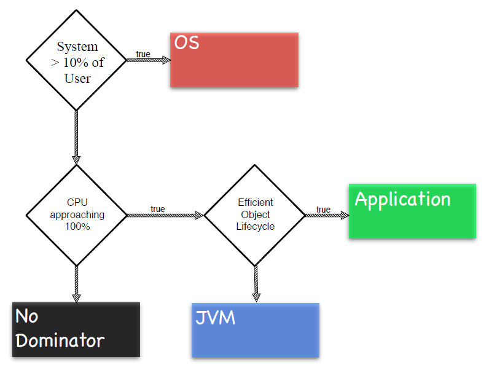

// build_options: 
Java Performance Tuning - Performance Diagnostic Model
======================================================
Arnauld Van Muysewinkel <avm@pendragon.be>
v0.0.1, 24-Sep-2014: Draft version
:backend: slidy
//:theme: volnitsky
:data-uri:
:copyright: Creative-Commons-Zero (Arnauld Van Muysewinkel)
:pdm-width: 25%

_(link:../extra/training_plan.html#(5)[back to plan])_

Content
-------

* Objective
* References
* The four layers model
 

Objective
---------

Reminder about OSes
-------------------

(scheduling...)

Reminder of some JVM internals
------------------------------

(GC, JIT...)

References
----------

Performance tuning::
* *Java Performance Tuning (training/workshop). Kirk Perdine. Kodewerk*
   http://www.kodewerk.com/workshop.html
* Java Performance. Charlie Hunt, Binu John. 2011. The Java Series. Addison-Wesley Professional
* Java Performance (The Definitie Guide). Scott Oaks. 2014. O'Reilly Media

Broader scope::
* Effective Java (2nd Edition). Joshua Bloch. 2008. The Java Series. Addison-Wesley
* Java Concurrency in Practice. Brian Goetz et al. 2006. Addison-Wesley Professional

Performance Diagnostic Model (PDM)
----------------------------------

* abstract model of a (Java) "system"
* identify important sub-systems and their role in the whole
* *4 layers model*
* each sub-system provides specific resource(s) +
  => is responsible for specific performance issues
* define measurements applicable to each sub-system
* define a methodology to study the system

Layer 1: OS
-----------

[width="{pdm-width}", halign="center", float="right"]
|===========
| {nbsp}
| {nbsp}
| {nbsp}
| OS (Hardware)
|===========

Role:: Manages access to hardware via:
* device drivers -> uses interrupts
* queues -> uses memory
* schedulers -> uses CPU

Resources::
* CPU: threads schedulling, locks
* Memory managemebt
* I/O: disk, net

*Hardware resources have limited capacity!*

Layer 2: JVM
------------

[width="{pdm-width}", halign="center", float="right"]
|===========
| {nbsp}
| {nbsp}
| Java VM
| OS (Hardware)
|===========

Role::
* byte code interpretation
* Just-In-Time (JIT) compilation
* Memory management:
** Memory allocation
** Garbage Collector (GC)

Resources::
* Memory
* Process

Layer 3: Application
--------------------

[width="{pdm-width}", halign="center", float="right"]
|===========
| {nbsp}
| Application
| Java VM
| OS (Hardware)
|===========

Role::
* interpret end-user demands
* arbitrate access to non-sharable resources (locks)
* interacts with external systems

Resources::
* locks
* external systems

Layer 4: Actors
---------------

[width="{pdm-width}", halign="center", float="right"]
|===========
| Actors
| Application
| Java VM
| OS (Hardware)
|===========

Role::
* places load on the system: end-user, external systems, batches

Usage patterns?::
* use cases
* load (# of concurrent users)
* velocity (speed of execution)
* ...

4 Layers: Summary
-----------------

[width="50%", halign="center", align="center"]
|===========
| *Actors* +
Usage patterns
| *Application* +
Locks, External systems
| *Java VM* +
Memory, Process
| *OS (Hardware)* +
CPU, Memory, Disk IO, Network, Locks
|===========

Dominant Consumers
------------------

To pose a diagnostic, we'll try to identify the dominant consumer of the CPU.

Four candidates::
[role="incremental"]
* 'Application' -> architecture? algorithmic?
* 'JVM' -> objects life-cycle? JIT? (very rare)
* 'OS' -> inefficient use of resources?
* '"None"' -> something else is keeping threads out of the CPU
** ! Check 'Actors' -> Is there enough load on the system?

Dominator Decision Tree
-----------------------

