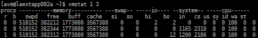
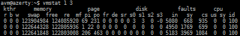
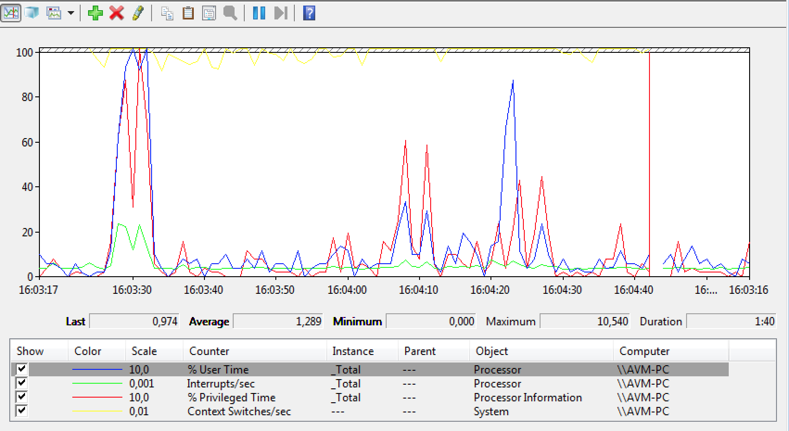
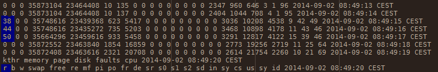
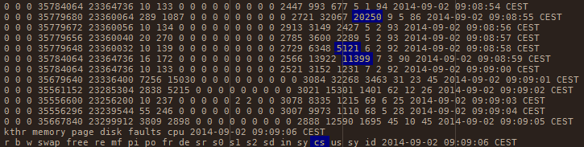
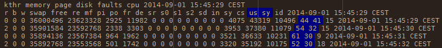

// build_options: 
Java Performance Tuning - PDM Layer 1: Operating System
=======================================================
Arnauld Van Muysewinkel <avm@pendragon.be>
v0.0, dd-mmm-2015: Draft version
:backend: slidy
//:theme: volnitsky
:data-uri:
:copyright: Creative-Commons-Zero (Arnauld Van Muysewinkel)
:pdm-width: 25%
:tabletags-blue.bodydata: <td style="background-color:skyblue;text-align:center">|</td>
:tabledef-default.blue-style: tags="blue"

Content
-------

* ...
* metrics: vmstat, mpstat, memstat, lsof, JMeter Perfmon Server Agent, Windows Performance Monitor (perfmon)
* tools: top (U*X), perfmon (Windows), custom scripts

_(link:../0-extra/1-training_plan.html#_presentations[back to course plan])_

Dominant Consumer: OS
---------------------

[width="{pdm-width}", halign="center", float="right"]
|===========
| Actors
| Application
| Java VM
b| OS (Hardware)
|===========

Usual causes::
* excessive context switching
** lock contention?
* Disk I/O
* Network I/O

If OS spends time managing access to resources, there will be more CPU system time than usual.

IMPORTANT: *Symptom* +
Proportion of CPU system time vs. user time is too high.

Dominant Consumer: "None"
-------------------------

Usual causes::
* slow I/O
* synchronous calls to slow external systems
* over worked connection or thread pool
* faulty, misconfigured or otherwise slow hardware network/disk
** DNS

_+ Make sure there is enough load on the system!_

IMPORTANT: *Symptom* +
Low CPU usage and no system CPU time

Resources consumption monitoring: vmstat
----------------------------------------

[source,sh]
----
> vmstat [delay_in_sec [count]]
----
On Linux +
 +
On Solaris +

CAUTION: First line shows consolidate data since boot time +
Each next line covers one interval of time (delay_in_sec)

Resources consumption monitoring: Perfmon
-----------------------------------------

On Windows +

// some strange behavior with image conversion inside asciidoc(/libpng)
// tried to re-save, convert (GIF,JPG), resize, re-snapshot ... the initial image, but to no avail
// only this re-snapshot+cropped version is finally working, by chanche

Case studies: CPU bottleneck
----------------------------

IMPORTANT: *Symptoms* +
+r >> 2 * # CPU+ (4 in this case)

TIP: *Resolution* +
- add more CPU +
- or optimize algorithm (e.g. https://en.wikipedia.org/wiki/Strength_reduction[strength reduction])

Case studies: starvation
------------------------

IMPORTANT: *Symptoms* +
+cs high and CPU low+ -> Lots of context switching +
=> threads don't consume their alloted time quantum

TIP: *Resolution* +
find what's blocking threads progress: locks, I/O, network 

Case studies: Dominant OS
-------------------------

IMPORTANT: *Symptoms* +
+sy > us ÷ 10+ -> OS activity dominates

TIP: *Resolution* +
- high cs -> lock contention? +
- I/O? (disk or network)

