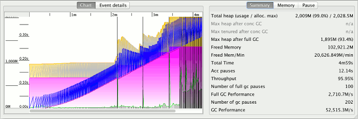
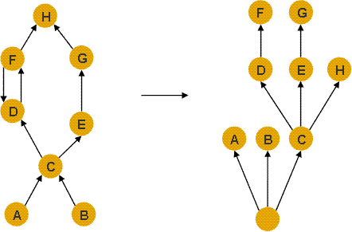

// build_options: 
Java Performance Tuning - PDM Layer 2 : Java Virtual Machine
============================================================
Arnauld Van Muysewinkel <avm@pendragon.be>
v0.1, 27-Oct-2015: Draft version
:backend: slidy
//:theme: volnitsky
:data-uri:
:copyright: Creative-Commons-Zero (Arnauld Van Muysewinkel)
:icons:
:pdm-width: 25%
:tabletags-green.bodydata: <td style="background-color:palegreen;text-align:center">|</td>
:tabledef-default.green-style: tags="green"
:nil: pass:[</>]

Content
-------

* Usual causes
* GC Log
* Metrics
* Heapdump
* Dominator Tree

_(link:../0-extra/1-training_plan.html#_presentations[back to course plan])_

Dominant Consumer: JVM
----------------------

[width="{pdm-width}", halign="center", float="right"]
|===========
| Actors
| Application
g| Java VM
| OS (Hardware)
|===========

Usual causes::
* Memory management
** memory leaks, System.gc(), premature promotion, memory pools sizing
* (JIT tuning usually not necessary, except when extreme speed is needed)

Examine GC log.

IMPORTANT: *Symptom* +
GC CPU ratio too high (too many GC events, too much time in GC...)

Memory usage monitoring: GC log
-------------------------------

Records all activities of the GC.

Not activated by default.

[source, sh]
----
> java -Xloggc:gc.log -XX:+PrintGCDetails -XX:+PrintGCDateStamps ...
----

Important metrics
-----------------

[horizontal]
Liveset:: amount of memory actually required. Given the behaviour of the garbage collection,
it is known only after an old (full) collection. +
-> *memory leak* detection
Memory allocation rate:: speed of memory allocation by the application.
It depends on the application usage and application implementation details. +
-> in general systems are able to sustain a rate <{nil}= *500 MB/s*, not more
GC CPU usage:: proportion of time the CPU is busy doing GC +
-> Should not exceed *2-3%*
CPU throuhgput:: proportion of time the CPU is _not_ busy doing GC +
-> +100% - GC CPU usage+

GCViewer
--------

Memory usage analysis
---------------------

To generate a heap dump:

* Find the PID of the JVM

[source,sh]
----
> ps -A | grep java
----

* Send the order to the JVM

[source,sh]
----
> jmap -dump:format=b,file=heapdump.hprof <pid>
----

Use a tool to analyse the heapdump, e.g. MAT.

Memory usage analysis: Dominator tree
-------------------------------------

* An object x *dominates* an object y if every path in the object graph from the start (or the root) node to y must go through x.
* The *immediate dominator* x of some object y is the dominator closest to the object y.
* A *dominator tree* is built out of the object graph. In the dominator tree each object is the immediate dominator of its children, so dependencies between the objects are easily identified.
* The objects belonging to the sub-tree of x (i.e. the objects dominated by x ) represent the *retained set* of x .
* *Shallow heap* is the memory consumed directly by one object.
* *Retained heap* is the size of the retained set, i.e. the sum of the shallow heap of all object in the retained set.

IMPORTANT: *Retained set* of X is the set of objects which would be removed by GC when X is garbage collected.

Memory usage analysis: Dominator tree
-------------------------------------

Objects graph vs. dominator tree:

(A & B are GC roots)
