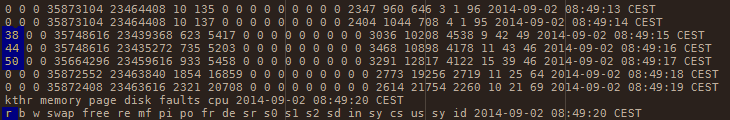
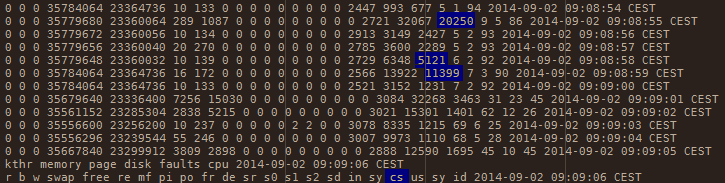

Performance Diagnostic Model and sample case studies
====================================================
:author:        Arnauld Van Muysewinkel
:email:         Arnauld.VanMuysewinkel@smals.be
:copyright:     SIC @Smals
:revision:      0.0.1
:revdate:       24-Sep-2014
:revremark:     DRAFT
:service:       SIC
:backend:       slidy
:duration:      30
:theme:         volnitsky
:max-width:     45em
:icons:
:data-uri:
:pdm-width:			25%

Plan
----
* Dominator Decision Tree
* Using vmstat
* Case studies

Dominant Consumer: OS
---------------------

[width="{pdm-width}", halign="center", float="right"]
|===========
| Actors
| Application
| Java VM
| *OS (Hardware)*
|===========

Usual causes::
* excessive context switching
** lock contention?
* Disk I/O
* Network I/O

If OS spends time managing access to resources, there will be more CPU system time than usual.

IMPORTANT: *Symptom* +
Proportion of CPU system time vs. user time is too high.

Dominant Consumer: JVM
----------------------

[width="{pdm-width}", halign="center", float="right"]
|===========
| Actors
| Application
| *Java VM*
| OS (Hardware)
|===========

Usual causes::
* Memory management
** memory leaks, System.gc(), premature promotion, memory pools sizing
* (JIT tuning usually not necessary, except when extreme speed is needed)

Examine GC log.

IMPORTANT: *Symptom* +
GC CPU ratio too high (too many GC events, too much time in GC...)

Dominant Consumer: Application
------------------------------

[width="{pdm-width}", halign="center", float="right"]
|===========
| Actors
| *Application*
| Java VM
| OS (Hardware)
|===========

Usual causes::
* Wrong algorithm
* Unnecessary work
* ...

Execution profiling.

IMPORTANT: *Symptoms* +
- High CPU and no abnormal pattern in GC log
- Too many threads waiting for CPU

Dominant Consumer: "None"
-------------------------

Usual causes::
* slow I/O
* synchronous calls to slow external systems
* over worked connection or thread pool
* faulty, misconfigured or otherwise slow hardware network/disk
** DNS

_+ Make sure there is enough load on the system!_

IMPORTANT: *Symptom* +
Low CPU usage and no system CPU time

Resources consumption monitoring: vmstat
----------------------------------------

[source,sh]
----
> vmstat [delay_in_sec [count]]
----
On Linux +
image:images/vmstat_linux.png[align="left"] +
On Solaris +
image:images/vmstat_solaris.png[align="left"]

CAUTION: First line shows consolidate data since boot time +
Each next line covers one interval of time (delay_in_sec)

Resources consumption monitoring: Perfmon
-----------------------------------------

On Windows +
image:images/perfmon_windows.png[width="700", align="center"]

Case studies: CPU bottleneck
----------------------------

IMPORTANT: *Symptoms* +
+r >> 2 * # CPU+ (4 in this case)

TIP: *Resolution* +
- add more CPU +
- or optimize algorithm (e.g. https://en.wikipedia.org/wiki/Strength_reduction[strength reduction])

Case studies: starvation
------------------------

IMPORTANT: *Symptoms* +
+cs high and CPU low+ -> Lots of context switching +
=> threads don't consume their alloted time quantum

TIP: *Resolution* +
find what's blocking threads progress: locks, I/O, network 

Case studies: Dominant OS
-------------------------

image:images/vmstat_sample_us-sy.png[align="left"]

IMPORTANT: *Symptoms* +
+sy > us ÷ 10+ -> OS activity dominates

TIP: *Resolution* +
- high cs -> lock contention? +
- I/O? (disk or network)

Memory usage monitoring: GC log
-------------------------------

NOTE: Will be described in a future presentation.

Application behaviour: Profiling
--------------------------------

NOTE: Will be described in a future presentation.
